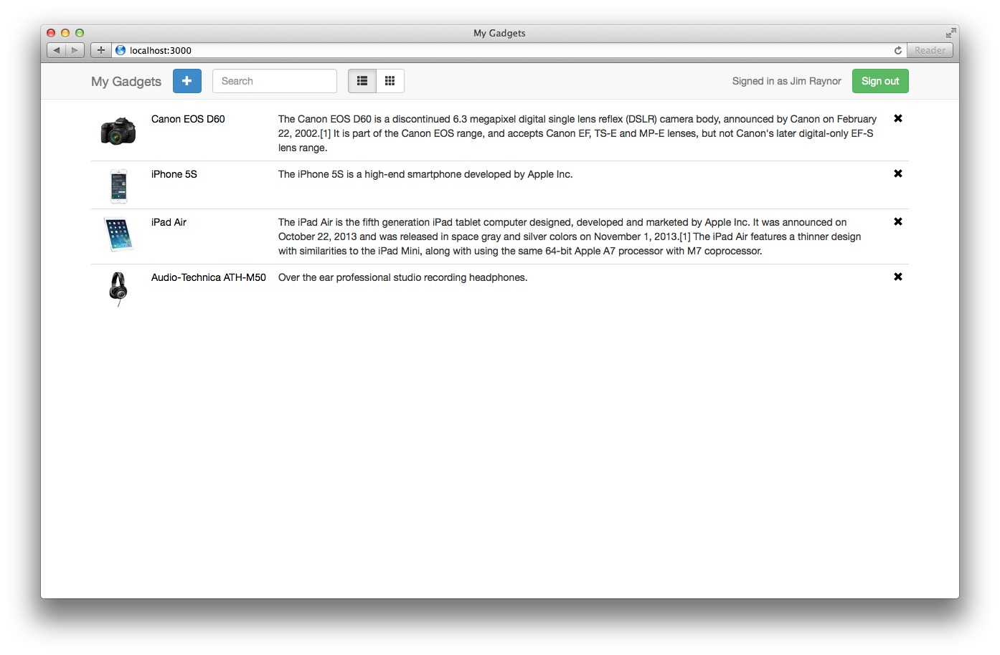
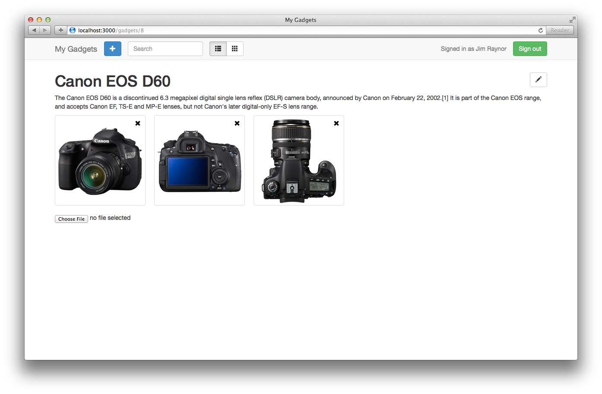

Personal Gadget Management

# Notes

CSS & HTML where written ASAP and are messy. We can use LESS and HTML helpers to make it cleaner.

It is not fully REST now, because some part of information (current user) is preserved in
session. As a result, same url `app.com/gadgets/:id` may have different result for different users.
One way to fix it is to add user prefix `app.com/users/:user_id/gadgets/:id` but there's a better way -
use subdomain for each user - `:user_id.app.com/gadgets/:id`.

About TDD-first approach. I know what it means and how to apply it and used. But stopped using it
couple of years ago.
Because in my opinion it is overrated and by itself it doesn't provide better design nor better
product quality. If you notice recent news - David Hansson and Kent Beck also recently posted
notes about not using TDD.

I didn't have enough time and wrote only minimal tests. For more details you can also take a look
at my blog - I wrote about testing in general and using browser emulator to test JS Web Applications
http://alex-craft.com/blog/tag/Testing